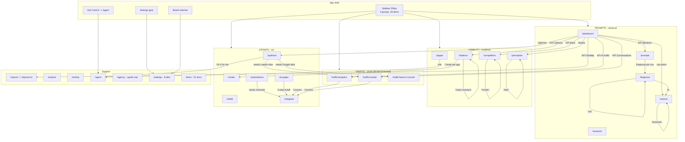

# Trakkr replication spec - index

Source: live crawl of `https://trakkr.ai`, logged in as the Venture PR brand, 2026-08-07.
Bundle: `/assets/index-DaRqwO8U.js` plus 158 lazy chunks.
Method: observation only. Nothing in these files is inferred. Every unobservable item says `NOT OBSERVED`.

No agent clicked a control that deletes, connects, authorises, pays, sends, publishes, or spends credits. Those controls are recorded in tables instead.

---

## 1. The files

| File | Lines | Covers |
|---|---|---|
| `01-design-system-and-shell.md` | 1909 | CSS tokens, fonts, type scale, spacing, sidebar, header, Cmd+K palette, shared components, responsive rules |
| `02-prompts-group.md` | 1377 | `/dashboard`, `/actions`, `/prompts`, `/research`, `/diagnose`, plus every drawer |
| `03-visibility-group.md` | 1453 | `/pages`, `/citations`, `/competitors`, `/perception`, plus every tab and chip |
| `04-traffic-and-integrations.md` | 921 | `/traffic/*`, `/ai-pages`, `/reddit`, `/integrate`, `/sites`, plus all connector cards |
| `05-growth-actions.md` | 1587 | `/create`, `/optimize`, `/automations`, plus the settings modal and the rule builder |
| `06-reports-account-agency.md` | 1185 | `/reports`, `/explore`, `/activity`, `/agent`, `/agency`, `/settings`, `/upgrade` |
| `07-routes-and-api.md` | 1617 | ~700 routes, 45 verified redirects, ~120 live endpoints, the docs tree, the MCP surface |
| `08-marketing-site.md` | 941 | The public site and every programmatic template |
| `09-connected-states-from-docs.md` | - | Traffic, crawler, visitors, AI Pages install, Sites. `[DOCS]` evidence only |
| `10-agency-and-locked-features.md` | - | Agency suite, white-label, Reddit. `[DOCS]` evidence only |
| `11-api-and-mcp-reference.md` | ~2900 | 25 API doc pages, `openapi.json` (96 paths), 76 MCP tools, 18 resources, 6 workflows |
| `12-ui-states-and-visuals.md` | - | KPI tooltips, Recharts tokens, toasts, skeletons, popovers, row hover |
| `13-logged-out-and-mobile.md` | - | Logged-out marketing site, the 767px gate, tablet layout, all media queries |

Read `07` first. It is the backbone. Read `01` second. It defines every visual value the other files reference.

### Evidence strength

| Grade | Files | Meaning |
|---|---|---|
| Observed | 01-08, 12, 13 | Read from the live product or the shipped bundle. Strongest. |
| Documentation | 09, 10 | Read from `/learn/docs`. Docs can lag the product. Every claim carries `[DOCS]`. |
| Mixed | 11 | Doc pages plus `openapi.json` plus decompiled chunks. Each claim names its source. |

---

## 2. Scale of the product

| Thing | Count |
|---|---|
| Routes in the bundle | ~700 (about 90 are internal or showcase, not product) |
| Route clusters | 10 |
| Verified redirects | 45 live, ~110 more read from the router |
| Backend endpoints seen live | ~120 across 19 app pages |
| Backend endpoints in the chunks | ~600 |
| Documentation pages | 51 |
| Public API endpoints documented | 27 |
| MCP tools | 76, in 12 groups, plus 18 resources and 6 workflows |
| Sidebar routes | 18 |
| Integration cards | 27 |

Backend base is `https://api.trakkr.ai`. Auth is a Supabase bearer token.

---

## 3. The graph

Tab state uses a different query parameter per route. There is no shared convention:

| Route | Parameter |
|---|---|
| `/citations` | `?view=` |
| `/competitors` | `?mode=` |
| `/perception` | `?tab=` |
| `/settings` | `?tab=` |
| `/actions` | `?actionId=` opens a drawer |
| `/prompts` | `?highlight=`, `?view=topics` |
| `/diagnose` | `?id=`, or `?query=&autoStart=true` |

All other filters, chips, sorts and groupings are client-only. They never touch the URL.

---

## 4. Defects found in the live product

Record these before you clone them.

1. **The dashboard ships dead deep links.** The rankings rows emit `href="/competitors?tab=head-to-head&rival=NAME"` and the model cards emit `href="/competitors?mode=prompts&model=NAME"`. The router ignores `tab` and strips `model`. The head-to-head view is an inline row expansion, not a routed view.
2. **Pricing contradicts itself.** `/pricing` serves GBP (£79 / £395 / from £790). The home page serves USD ($100 / $500).
3. **Settings, White-Label tab renders an empty body.**
4. **`/client` never finishes loading.** It sits on "Loading your brands..." and shows no login form.
5. **All 8 `/agency` routes render the same Scale-plan upsell.** There is no agency UI on this plan.
6. **Explore, Tags dimension is disabled.**
7. **Two views never finish loading**: the citations source profile, and the Outreach prompt-grouping stream.

---

## 5. Corrections found in the second pass

These fix errors in the first eight files. The later file wins.

| Wrong | Right | Source |
|---|---|---|
| `/article/:slug` is a route | It never resolves. The real route is `/blog/:slug` | `13` |
| `/enterprise` is a page | It 301s to `/trakkr-for/enterprise` | `13` |
| `/rankings` is a page | It 301s to `/data/rankings` | `13` |
| 8 agency workspaces | The docs name 4: Clients, Actions, Reports, Pitches. Several `/agency` paths are redirects | `10` |
| Search Console is a documented feature | The page exists in the app. The docs never describe it | `09` |
| `/learn/docs/features/reports` is its own page | It serves the same body as `reports-export` | `10` |
| The API has 27 endpoints | `openapi.json` exposes 96 paths. 58 have no doc page | `11` |

## 6. What is still not observed

| Gap | Cause | How to close it |
|---|---|---|
| Every connected-state screen: layout, columns, empty states | The docs contain NO product screenshots. Connectors are disconnected | Connect a real GA4, host log drain, or Search Console account |
| `/client/*` white-label portal | The live route hangs on "Loading your brands...". The docs do not describe its screens | Open a real client portal |
| Agency UI | Plan-locked. The docs give prose only | Upgrade to Scale |
| Screenshots at any width | The browser pane never composited. Two agents confirmed | A working browser |
| The 2 stuck `/citations` views | Seen hanging by two independent agents. Likely a product defect | Retry, then report to Trakkr |
| Per-page filter operator values | The pane died before capture | One short sweep |
| API response bodies for the internal API | Only 18 were fetched live | Call them with a token |

Six models return no data on this account. Only ChatGPT and Perplexity have values. Any clone built from this data will show mostly empty charts.

## 7. The API split

The public API and the internal API are almost disjoint. This matters more than any UI detail.

- Public, documented: `/get-brands` style. Auth is one `sk_live_` bearer key, Scale plan only. An `mcp_connect_` token works on any paid plan.
- Internal, undocumented: `/brands/{id}` style on `https://api.trakkr.ai`, with Supabase bearer auth. It is about six times larger than the public surface.
- Only crawler, workflow and notification paths overlap.
- Rate limits are per IP, not per key: 60 read, 30 write, 10 or 5 for heavy writes. No rate-limit or `Retry-After` headers are sent.
- The error envelope is a single `detail` field, except 429, which uses `error`.

A clone must build the internal API. The public API is a thin, separate product.

---

## 6. Suggested build order

1. Tokens and shell, from `01`. The whole product is one shell plus a content pane.
2. Route table and redirects, from `07`.
3. The data tables. One table component serves `/actions`, `/prompts`, `/pages`, `/citations`, `/competitors`, `/reports` and `/create`.
4. `/dashboard`, because every other page hangs off its KPI tiles.
5. The four measurement pages, then the three action pages.
6. Connectors last. They need real third-party accounts.
