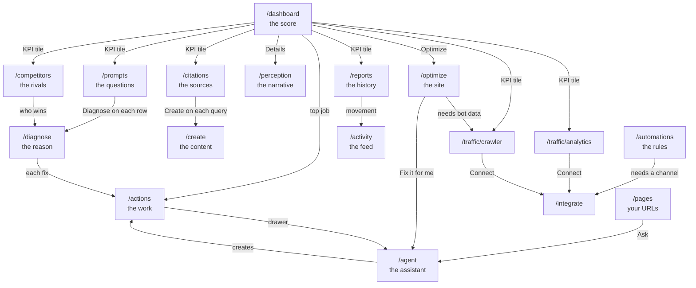

# Trakkr.ai - features, deep links and connections

This document tells you what each feature does. It tells you how each page links to the other pages.
It tells you which data each feature needs.

Source: a live crawl of `https://trakkr.ai` on 2026-08-07, with an account named Venture PR.
The route list comes from the application bundle `assets/index-DaRqwO8U.js` and 158 lazy chunks.

Evidence rule for this document:

- A statement with no mark comes from observation of the live product.
- A statement with `[DOCS]` comes from the documentation at `/learn/docs`.
- A statement with `[GAP]` could not be observed. The reason follows the mark.

---

## 1. What the product does

Trakkr measures how AI assistants answer buyer questions about a brand.

The product asks each AI model a set of questions. It reads each answer. It finds which companies the
model names. It finds the order of those companies. It records the position of your brand. It also
records each source that the model cites.

From that data the product builds six things:

1. A visibility score for your brand.
2. A ranking of your brand against every rival that the models name.
3. A list of the sources that the models trust.
4. A list of the questions where your brand is absent.
5. A list of technical faults on your website.
6. A list of jobs that raise the score.

---

## 2. The core loop

The product has one loop. Each page holds one step of the loop.

```
MEASURE  ->  EXPLAIN  ->  ACT  ->  PROVE
```

1. **Measure.** `/dashboard` shows the score. `/prompts` holds the questions. `/reports` holds the history.
2. **Explain.** `/diagnose` tells you why you lose one question. `/citations` tells you which sources win.
   `/competitors` tells you who beats you. `/perception` tells you how the models describe you.
3. **Act.** `/actions` holds the jobs. `/create` writes the content. `/optimize` repairs the website.
   `/automations` does the work again without you.
4. **Prove.** `/traffic` shows the visits. `/reports` shows the movement. `/activity` shows each change.

No page is a dead end. Each table row opens a drawer, a detail route, or a button that starts a job.

---

## 3. Navigation

The sidebar is 200 pixels wide. It collapses to 60 pixels. It holds 18 links in 4 groups.

| Group | Item | Route | Job |
|---|---|---|---|
| Prompts | Dashboard | `/dashboard` | Show the score today |
| Prompts | Actions | `/actions` | Hold the work queue |
| Prompts | Prompts | `/prompts` | Hold the questions |
| Prompts | Research | `/research` | Run one study outside the tracked set |
| Prompts | Diagnose | `/diagnose` | Explain one loss |
| Visibility | Pages | `/pages` | List your own URLs |
| Visibility | Citations | `/citations` | List the sources that the models quote |
| Visibility | Competitors | `/competitors` | Rank the rivals |
| Visibility | Perception | `/perception` | Score the brand narrative |
| Traffic | Visitors | `/traffic/analytics` | Count people who arrive from AI |
| Traffic | Crawlers | `/traffic/crawler` | Count AI bots on your site |
| Growth | Content | `/create` | Turn gaps into articles |
| Growth | Site Optimization | `/optimize` | Repair the website |
| Growth | AI Pages | `/ai-pages` | Serve crawlers a clean page |
| Growth | Reddit | `/reddit` | Watch Reddit threads |
| Growth | Automations | `/automations` | Run rules without you |
| Growth | Integrations | `/integrate` | Connect other systems |
| Footer | Settings | `/settings` | Control the account |
| Footer | Learn | `/learn` | Read the documentation |

The sidebar does not show six more pages that the product uses:
`/reports`, `/explore`, `/activity`, `/agent`, `/agency` and `/upgrade`.
You reach these pages from a button, a link, or a keyboard command.

---

## 4. Each feature in detail

### 4.1 Dashboard - `/dashboard`

**Job.** Answer one question: where does the brand stand today?

**Sections, in order.**

1. A header with the brand name and the data date. It holds Share, Export and Reports.
2. Six KPI tiles. Each tile is a link.
3. A visibility chart with a 7D, 14D and 30D switch.
4. A rankings list of 50 rivals.
5. An actions card with the top job.
6. Eight model cards, one for each assistant.
7. A top-prompts list.
8. A top-citation-sources list.
9. Two traffic tiles.

**Deep links out.** Each KPI tile owns one number. Each tile links to the page that owns that number.

| Tile | Goes to | Why |
|---|---|---|
| VISIBILITY | `/reports` | The history explains the movement |
| MENTIONS | `/prompts` | The questions produce the mentions |
| RANK | `/competitors` | The rivals set the rank |
| CITATIONS | `/citations` | The sources produce the citations |
| AI TRAFFIC | `/traffic/analytics` | The analytics account holds the visits |
| CONVERSATIONS | `/traffic/crawler` | The crawler log holds the bot visits |

More links out: `Manage` to `/competitors`, `View all` to `/actions`, `Explore` to `/citations`,
`Optimize` to `/optimize`, and `Details` to `/perception`.

**A defect.** The rankings rows write a link to `/competitors?tab=head-to-head&rival=NAME`.
The model cards write a link to `/competitors?mode=prompts&model=NAME`.
The router ignores `tab`. The router removes `model`. Both links fail.

### 4.2 Actions - `/actions`

**Job.** Hold each job that raises the score. One row is one job.

**Pipeline.** `found` to `planned` to `measuring` to `earned`.

**Controls.** This week, Results, Open, Type, Learning, New action, Export, and Columns and density.

**Deep link in.** `/actions?actionId=<uuid>` opens the detail drawer for one action.
The drawer holds four tabs: Brief, Steps, Agent and Activity.

**Where the rows come from.** `/diagnose` writes its fixes here. `/optimize` writes its findings here.

### 4.3 Prompts - `/prompts`

**Job.** Hold the questions that the product asks the models. The questions decide every other number.

**Tabs.** Prompts, Tags and Audiences. The Audiences tab holds two sub-tabs: Overview and Journey.

**Table columns.** PROMPT, AI VOL, 7D, SCORE, delta, ON and ADDED.

**Deep links in.**

- `/prompts?highlight=<uuid>` opens one prompt.
- `/prompts?view=topics` shows the topic view.

**Deep links out.** Each row holds a Diagnose link. The link carries the query text:
`/diagnose?query=<text>&autoStart=true&reportId=<uuid>`. The link starts the diagnosis immediately.

**Audiences.** An audience groups prompts by buyer type and by stage.
The stages are Awareness, Consideration and Decision.
One brand-wide score hides a large spread between audiences.

### 4.4 Research - `/research`

**Job.** Run one deep study outside the tracked prompt set.

**Controls.** One button, named `Run Research`.

### 4.5 Diagnose - `/diagnose`

**Job.** Explain why the models do not name your brand for one question.

**Deep links in.**

- `/diagnose?id=<uuid>` opens a finished report.
- `/diagnose?query=<text>&autoStart=true` starts a new run immediately.

**Report structure.**

1. A headline with the score, the best position, the models that answered, and the confidence.
2. A summary of two or three sentences.
3. A section named "What connects the dots". It joins signals that mean nothing alone.
4. A blockers list.
5. A fixes list. Each fix becomes an action.
6. A sources list with numbered markers.
7. A methodology panel.

**Deep link out.** Each fix creates a row in `/actions`.

### 4.6 Pages - `/pages`

**Job.** List your own URLs. Show how often the models cite each one.

**Columns.** PAGE, CITED and LAST CITED.

**Buttons on each row.** `Measure now` starts a check. `Ask` sends the page to `/agent`.

**State.** Most pages hold one of six checks. The page tells you to measure the other five.

### 4.7 Citations - `/citations`

**Job.** Show which websites the models quote when they answer questions in your category.

**Tabs.** Sources, Queries, Videos and Outreach. The tab parameter is `?view=`.

**Sources tab.** It holds three sub-views: Domains, Pages and Feed.
It holds type filters: All, Citing, Gaps, Media, Social, Reviews, Institutional, PR and Other.

**Queries tab.** It lists the search queries that produce citations.
Each row holds a `Create` button. The button sends the query to `/create`.

**Outreach tab.** It lists publishers that cite your rivals but not you.
It groups by Publisher, Prompt or Competitor. It tracks status: All, New, Contacted and Won.
It drafts a pitch for each publisher.

**Deep link in.** `/citations?source=<domain>` opens one domain.

### 4.8 Competitors - `/competitors`

**Job.** Rank your brand against every rival that the models name.

**Tabs.** Competitors, Prompts and Matrix. The tab parameter is `?mode=`.

**Filters.** All, Threats, Rising, Model and Groups.

**Columns.** Number, COMPETITOR, MENTIONS, VISIBILITY, TREND, H2H and WIN RATE.

**Head to head.** The duel is an inline row expansion. It is not a separate route.

**Aliases.** The page holds an alias panel. It also offers automatic alias detection.
An alias joins two names for one company, for example "Edelman" and "Edelman Digital".

### 4.9 Perception - `/perception`

**Job.** Show how the models describe your brand.

**Tabs.** Overview, Competitors, Claims and Tracked. The tab parameter is `?tab=`.

**Five scores.** Trust, Quality, Value, Market and Innovation.
Each score is a label, a number of 20 pixels, and a progress bar of 3 pixels.
Each score expands to four sub-attributes. One sub-attribute carries a FOCUS badge.

**Claims.** The page lists strengths and weaknesses. Each claim shows how many models made it.

**Goals.** A goal table shows the status of each theme: Achieved, Improving, or Needs attention.

### 4.10 Visitors - `/traffic/analytics`

**Job.** Count the people who reach your site from an AI assistant.

**State.** This feature needs Google Analytics.
`[GAP]` The connected screen was not observed. The account holds no connection.
The documentation holds no screenshot.

### 4.11 Crawlers - `/traffic/crawler`

**Job.** Show which AI bots read your site. Show whether those bots fail.

**Connectors.** Ten host options: Vercel, Netlify, Cloudflare, Next.js, Node and Express,
Nginx and OpenResty, AWS CloudFront, Akamai, Fastly, and Other.
Seven content system options: Webflow, Shopify, HubSpot, Squarespace, Wix, Framer and Ghost.

Akamai, Fastly and Other all open the same dialog.

**Deep link in.** `/traffic/crawler?tab=connections` opens the connector list.

### 4.12 Content - `/create`

**Job.** Turn a visibility gap into an article.

**Tabs.** Ideas, Drafts, Live and Campaigns.

**Idea table.** IDEA, SIGNAL, POTENTIAL, AI VOL and Actions.
The page groups ideas under a campaign name.

**Settings.** The settings dialog holds nine sections: identity, voice, messaging, audience,
templates, knowledge, destinations, site index, and agent automation.
The agent automation section holds 13 signals and 9 manual triggers.

**Deep link out.** `Write article` opens the editor at `/content/articles/<id>`.

### 4.13 Site Optimization - `/optimize`

**Job.** Find and repair the technical faults that stop a model from using your site.

**Six gate cards.** The cards show whether a model can reach, read and use each page.
One card carries the note "estimated, not observed". That card holds a guess, not a measurement.

**Findings table.** WORK, SEVERITY, PAGES and POINTS. The list sorts by points.

**Tabs.** Findings, Pages and History.

**Deep links out.** `Fix it for me` sends the job to `/agent`.
Two panels link to `/traffic/crawler?tab=connections` and to `/traffic/search-console`,
because those two data sources fill two of the gates.

### 4.14 AI Pages - `/ai-pages`

**Job.** Serve an AI crawler a version of your page that a model reads well.
A human visitor still sees the normal site.

**Four stages.** Detect, Transform, Serve and Track.

**Five setup steps.** Configure, Platform, Crawlers, Features and Install.
The product detects 17 crawlers. It offers 9 platforms and 5 features. All five features start on.

`[GAP]` Step 5 needs a write action, so it was not observed.

### 4.15 Reddit - `/reddit`

**Job.** Watch Reddit threads about your category.

**State.** The feature needs Reddit credentials. Nobody started it on this account.

### 4.16 Automations - `/automations`

**Job.** Run a rule without you.

**Rule shape.** WATCH, CHECK, ACT and TELL.

**Four ready patterns.** Citation guard, Comparison watcher, Weekly digest and Crawler health.

**Autonomy.** The builder holds a ladder of five rungs.
The ladder decides how much the rule may do alone. The product offers 17 triggers.

**Rule.** Nothing runs until you review it and turn it on.

### 4.17 Integrations - `/integrate`

**Job.** Connect Trakkr to the other systems that hold your data.

The page holds 27 cards in 7 groups.

| Group | Cards |
|---|---|
| Your website | WordPress, Shopify, Webflow, GitHub |
| AI traffic | AI Crawler Tracking, AI Pages, Google Search Console, Google Analytics |
| Advertising | OpenAI Ads |
| Alerts and tasks | Zapier, Make, Slack, Discord, Linear, GitHub Issues, Trello, Notion, Asana, Jira, Microsoft Teams, Gmail |
| Export | CSV Export, Google Sheets, Looker Studio |
| Developer | Webhooks, REST API, MCP Server |

### 4.18 Reports - `/reports`

**Job.** Hold the history of every measurement.

**Tabs.** Timeline and Monthly.

**Columns.** WHAT CHANGED, DATE, STATUS, VISIBILITY, PRESENCE and RANK.

**Detail route.** `/reports/<id>` holds three views: By model, By prompt and Matrix.

### 4.19 Explore - `/explore`

**Job.** Let you build your own table from the raw data.

**Rows.** Models, Prompts, Tags, Competitors and Dates. The Tags option is disabled.

**Measures.** Visibility, Presence, Avg Rank, Mentions and Number-one Share.

**Controls.** A trend window of 7, 14, 30, 60 or 90 days. A compare control. A filter builder.
A save-this-view button. An export button that downloads immediately.

### 4.20 Activity - `/activity`

**Job.** Show every change in one feed.

**Filters.** Type and date. Each event carries a severity.

### 4.21 Agent - `/agent`

**Job.** Answer questions about your own data in plain words.

**Panels.** A thread list, a memory panel, a connections panel, and a composer.
The memory panel is named "What I know about this brand".

**Deep link in.** Every `Ask` button and every `Fix it for me` button lands here.
The Ask command, `Cmd+K`, also lands here.

### 4.22 Settings - `/settings`

**Job.** Control the account.

**Eight tabs.** Profile, Brands, Billing, Team, White-Label, Custom, Security and Developer.
The tab parameter is `?tab=`.

`[GAP]` The White-Label tab renders an empty body.

### 4.23 Agency - `/agency`

**Job.** Manage many brands for many clients.

**State.** All eight agency routes render the same upsell for the Scale plan.
`[DOCS]` The documentation names four workspaces: Clients, Actions, Reports and Pitches.
The bundle exposes eight routes. The two sources disagree.

---

## 5. The deep-link grammar

The product does not use one parameter name for tabs. Each route uses its own name.

| Route | Parameter | Example |
|---|---|---|
| `/citations` | `?view=` | `/citations?view=outreach` |
| `/competitors` | `?mode=` | `/competitors?mode=prompts` |
| `/perception` | `?tab=` | `/perception?tab=claims` |
| `/settings` | `?tab=` | `/settings?tab=billing` |
| `/traffic/crawler` | `?tab=` | `/traffic/crawler?tab=connections` |
| `/actions` | `?actionId=` | opens a drawer |
| `/prompts` | `?highlight=` and `?view=` | opens a prompt, or the topic view |
| `/diagnose` | `?id=` and `?query=&autoStart=` | opens a report, or starts one |
| `/citations` | `?source=` | opens one domain |

Every other control is client-only. A filter, a sort, a grouping and a sub-tab do not change the URL.
You cannot share those states with a link.

---

## 6. Redirects

These paths hold no screen of their own. They send you to another screen.

| You type | You arrive at |
|---|---|
| `/workflows` | `/automations` |
| `/prism` | `/ai-pages` |
| `/narratives` | `/perception` |
| `/accuracy` | `/dashboard` |
| `/playbook` | `/dashboard` |
| `/audiences` | `/prompts`, Audiences tab |
| `/outreach` | `/citations?view=outreach` |
| `/brands` | `/settings?tab=brands` |
| `/inbox` | `/dashboard` |
| `/enterprise` | `/trakkr-for/enterprise` |
| `/rankings` | `/data/rankings` |

Navigation confirmed 45 redirects. The router holds about 110 more.

---

## 7. The connection map



**Read the map like this.** The dashboard sends you to the page that owns each number.
That page sends you to the reason. The reason sends you to the work.
The work sends you to the assistant or to the editor. The history proves the result.

---

## 8. Surfaces on every page

| Surface | Job |
|---|---|
| Brand switcher | Change the active brand. Every page follows this choice. |
| Ask, `Cmd+K` | Open the command palette. It jumps to a page, or it asks the agent. |
| Connect your AI | Install the Trakkr MCP server in Claude, Cursor or another client. |
| Settings gear | Open `/settings`. |
| Share and Export | Send a page out as a link or as a file. |

---

## 9. What each feature needs

| Feature | Needs | Works without it? |
|---|---|---|
| Dashboard, Prompts, Diagnose, Competitors, Perception, Citations | Model access only | Yes |
| Pages, Site Optimization | A public website | Yes |
| Crawlers | A log drain from your host | No |
| Visitors | Google Analytics | No |
| Search Console | A verified Google property | No |
| Reddit | Reddit credentials | No |
| Agency, White-Label | The Scale plan | No |

Six of the eight models returned no data on the observed account.
Only ChatGPT and Perplexity produced values. A new account shows mostly empty charts.

---

## 10. Defects in the live product

Do not copy these.

1. The dashboard writes two link shapes that the router does not accept:
   `?tab=head-to-head&rival=` and `?mode=prompts&model=`.
2. `/pricing` shows pounds. The home page shows dollars.
3. The Settings White-Label tab renders an empty body.
4. `/client` never finishes to load. It shows no login form.
5. All eight agency routes render the same upsell.
6. The Explore Tags row option is disabled.
7. Two views never finish to load: the citation source profile, and the Outreach plan stream.
   Two separate crawls saw the same failure.
8. `/learn/docs/features/reports` and `/learn/docs/features/reports-export` serve the same body.

---

## 11. Scale of the product

| Item | Count |
|---|---|
| Routes in the bundle | About 700. About 90 are internal or demonstration routes. |
| Confirmed redirects | 45 by navigation. About 110 more in the router. |
| Backend endpoints seen live | About 120 |
| Backend endpoints in the chunks | About 600 |
| Public API paths in `openapi.json` | 96. Only 27 hold a documentation page. |
| Documentation pages | 51 |
| MCP tools | 76, in 12 groups, with 18 resources and 6 workflows |
| Integration cards | 27 |

The public API and the internal API are almost separate products.
The public API uses a `/get-brands` shape. The internal API uses a `/brands/{id}` shape.
Only the crawler, workflow and notification paths appear in both.

---

## 12. Limits of this document

- The connected state of Visitors, Crawlers and Search Console was not observed.
  The account holds no connection. The documentation holds no screenshot.
- The agency screens were not observed. The plan locks them.
- The white-label portal was not observed. The route does not render.
- No screenshot was captured. The browser did not compose an image.

Each limit above is a missing observation. This document holds no invented feature.
